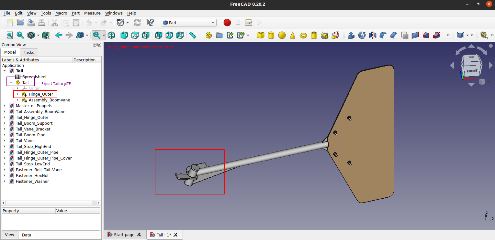
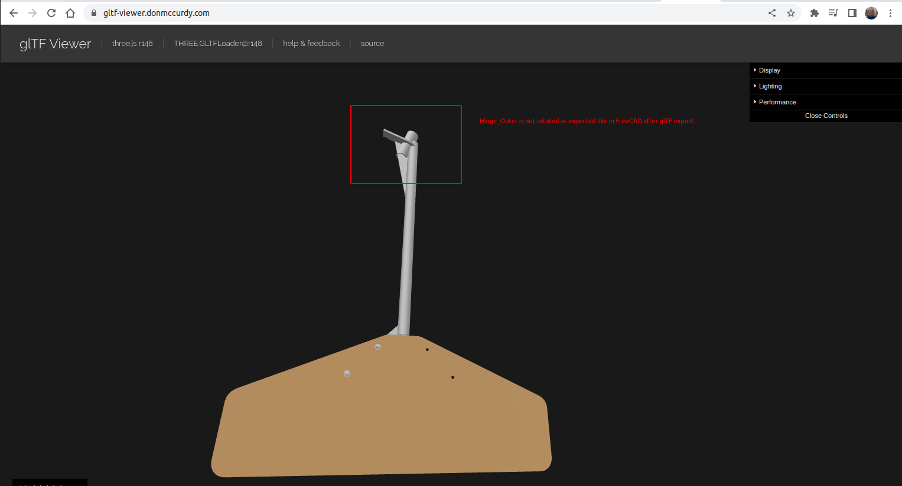

# FreeCAD glTF Export Issue

**Summary:** glTF export in FreeCAD doesn't respect model placement for unknown reasons.

|Before Export|After Export|
|-------------|------------|
|||

Steps to reproduce:
1. Clone repository.

       git clone https://github.com/gbroques/freecad-gltf-export-issue.git

2. Open latest released version of FreeCAD ([v0.20.2](https://github.com/FreeCAD/FreeCAD/releases/tag/0.20.2) at the time of writing). 
3. Open [Tail/Tail.FCStd](./Tail/Tail.FCStd) from FreeCAD.
4. Select `Tail` in Tree view.
5. File -> Export -> [`tail.glb`](./tail.glb)
6. Open [`tail.glb`](./tail.glb) in a online glTF viewer such as:
    * https://gltf-viewer.donmccurdy.com/
    * https://modelviewer.dev/editor/
7. Observe that `Hinge_Outer` (the piece highlighted in red) is not rotated correctly upon exporting.

FreeCAD About:
```
OS: Ubuntu 20.04.5 LTS (ubuntu:GNOME/ubuntu)
Word size of FreeCAD: 64-bit
Version: 0.20.2.29603 (Git) AppImage
Build type: Release
Branch: (HEAD detached at 0.20.2)
Hash: 930dd9a76203a3260b1e6256c70c1c3cad8c5cb8
Python 3.10.8, Qt 5.15.4, Coin 4.0.0, Vtk 9.1.0, OCC 7.6.3
Locale: English/United States (en_US)
Installed mods: 
  * fasteners 0.4.25
  * freecad-to-obj
  * openafpm-cad-core
```
